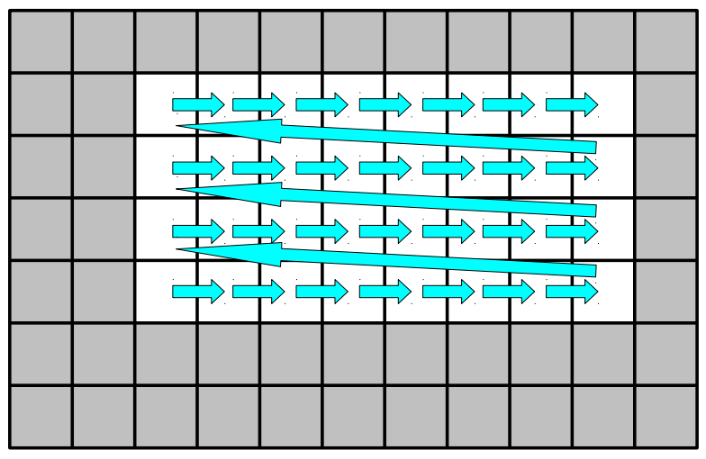
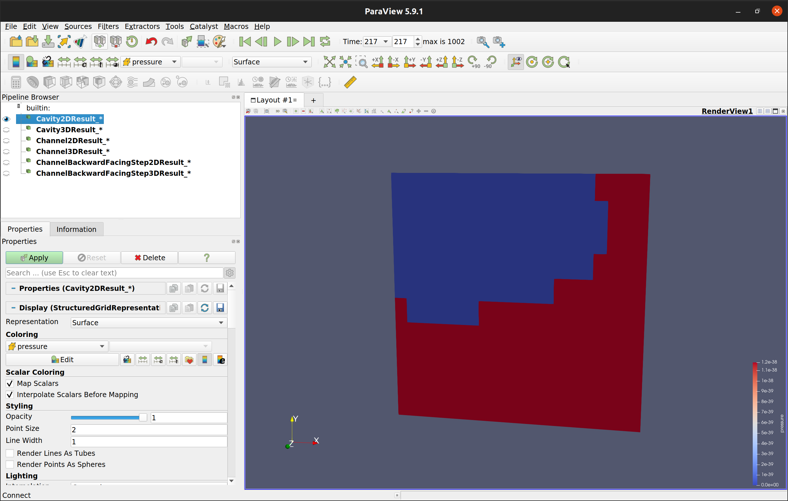
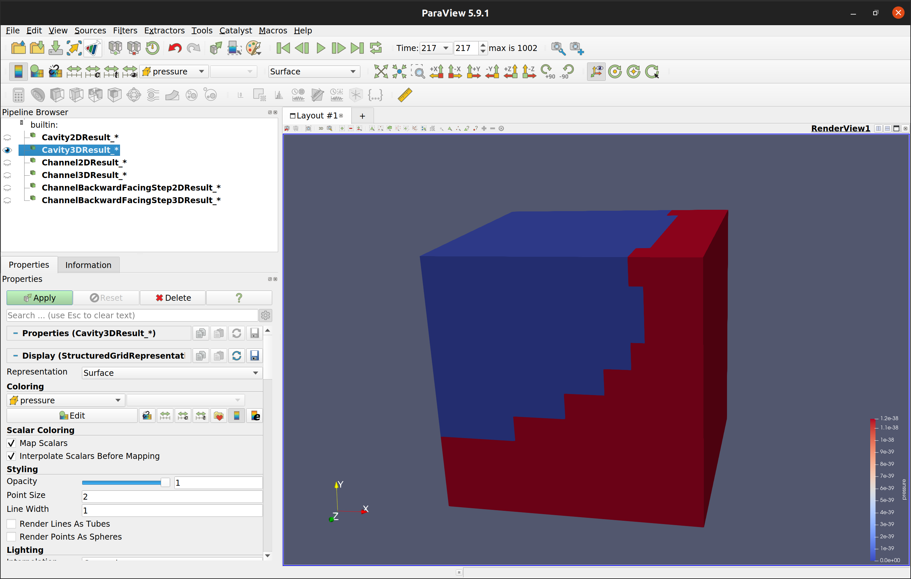
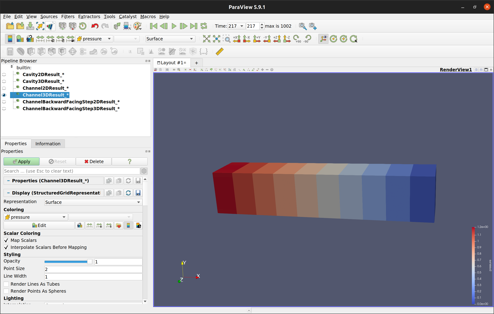
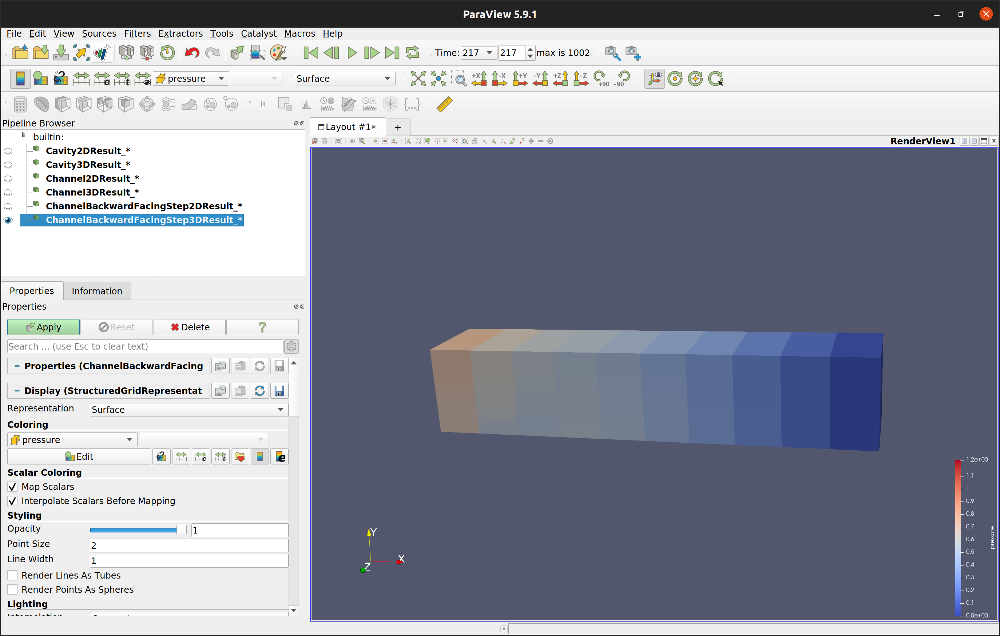
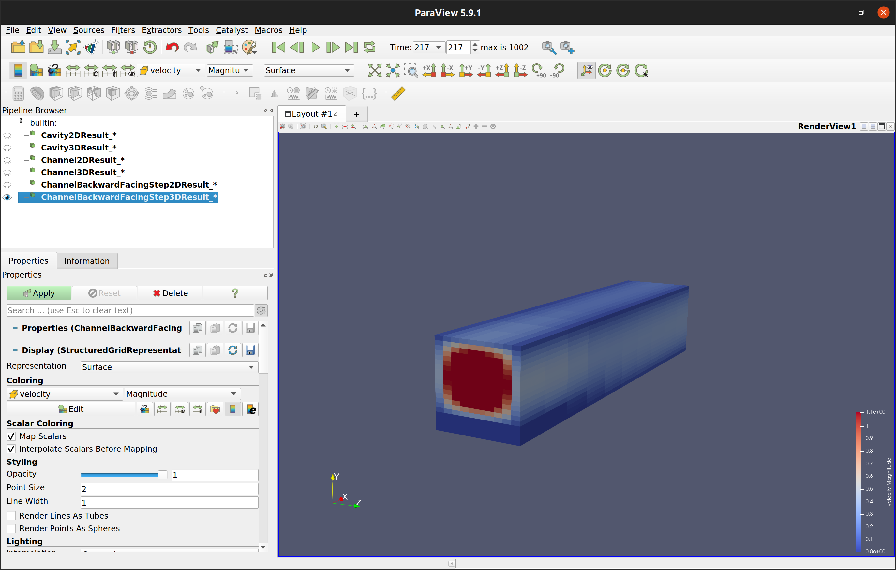
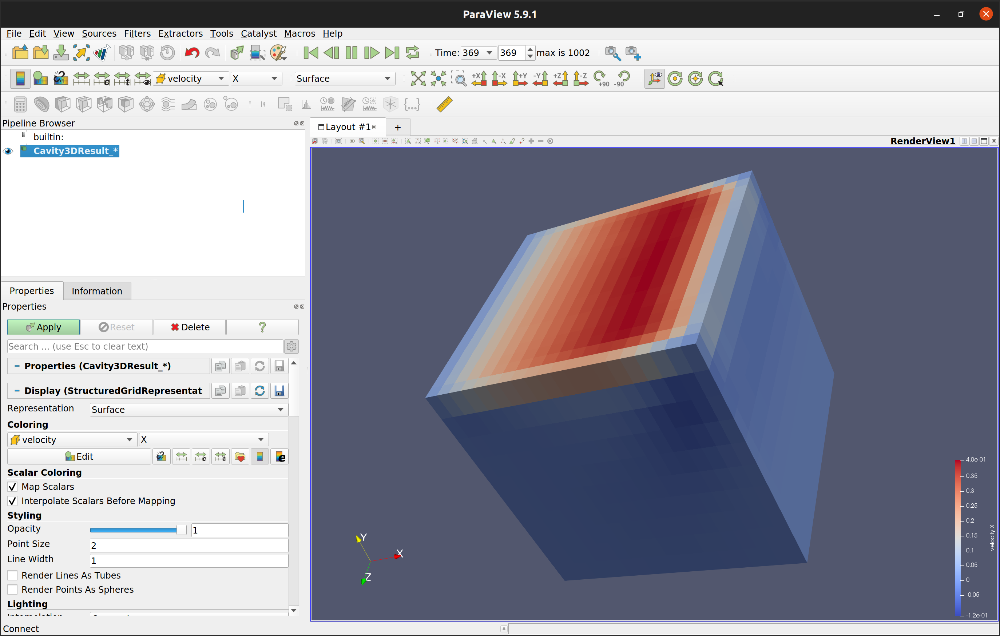

# Turbulent Flow Simulation on HPC-Systems

## Worksheet 1: Getting Started

#### Part 1: VTK Stencil

Working on the very first worksheet of this course, I got familiar with the skeleton code that we will be using throughout the course. I have also read through the **MPI** architecture in the project since I had done a few project with **MPI**.

After implementing the hands-on task in the class, **Double Pressure Stencil**, I understood what was expected of us in this worksheet. So at first, I started implementing the **apply** function. In this function, given a cell, we are expected to get the pressure (_at the center of the cell_) and velocity values (_average across the cell_) from **Flow Field**. After getting those values, I stored them in the object by making use of the **vector** data structure in order to access the values of the particular cells during the **write** operation. I also needed to know the **First Corner**, which is the start of the _White Region_. For that reason, I simply kept the first iterated _cell indexes_. The code snippet below shows the implementation of the **apply** function:

```{cpp}
// Init data structures
FLOAT pressure; auto* velocity = (FLOAT*) malloc(3 * sizeof(FLOAT));

// Set the starting position, the first corner!
if (firstCornerInd_ == nullptr) setFirstCorner_(i, j, k);

// Get the pressure and velocity
if (parameters_.geometry.dim == 2) { // 2D
    flowField.getPressureAndVelocity(pressure, velocity, i, j);
    velocity[2] = 0.0; // Set z-velocity to 0!
} else if (parameters_.geometry.dim == 3) { // 3D
    flowField.getPressureAndVelocity(pressure, velocity, i, j, k);
} else {
    std::cerr << "This app only supports 2D and 3D geometry" << std::endl;
    exit(1);
}

// Store the data
pressures_.push_back(pressure); velocities_.push_back(velocity);
```

As a second step, I have implemented the **write** functionality, which writes **VTK** files with a time information (in _microseconds_) appended to the filename. For that I have created separate function for _writing the nodes/points_, _writing the pressures_ and _writing the velocities_ for readability purposes. For keeping this report as short as possible, I decided not to include the code blocks for this since it's longer than **apply**. However, feel free to check it [here](https://gitlab.lrz.de/erdenbatuhan/hpc_turbulence_code_skeleton/-/blob/2472ab6961f6aef8f54b57d85470a64ac32e2f03/Source/Stencils/VTKStencil.cpp)! 

_**Keep in mind** that we have more nodes than we have cell values because **VTK** differentiates between vertex (or node) and cell values, and we use quadrilateral or octahedral cells on a uniform grid. For example, if we had **20 * 10 = 200** cells in a **2D** space, we would have **(20 + 1) * (10 + 1) = 231** nodes._ 

The functions **getPosX** and **getDx** are utilized to write the points.

#### Part 2: Handling the Ghost Cells and always working in the White Region:

As you might remember from the lecture, we have boundaries around our workable region (_for ease of coding and parallelization_). As can be seen in the picture below, in addition to the _default boundary_ where the workable region is covered by a single cell space, we also have some additional ghost cells that we need to take care. For that reason, I have used the **lowOffset** and **highOffset** parameters of the **Iterator** class, which is _bounded iteration_ where by default, the _1-layer of default boundary_ is already handled. That's why instead of setting **lowOffset** to **2** and **highOffset** to **1**, I set them **1** and **0** respectively. After setting those values correctly, the **Iterator** now iterates only in the _White Region_.



#### Part 3: Plotting the VTK when the "time" is right!

- **dt_convergence** = adaptive time stepping, always changing.

- **dt_vtk** = time step size given in the parameters.

- **dt**, the actual time step.

We always wish things that cannot always happen, like having **dt_convergence** and **dt_vtk** same all the time! Since we are required to plot **every 0.01 seconds (or whatever is set in the parameter)**, I had to handle the cases where **dt_convergence** and **dt_vtk** are not the same:

##### 1) dt_convergence = dt_vtk

Everything works as expected!

##### 2) dt_convergence > dt_vtk

**dt_vtk** acts as an upper bound for **dt**. We simply set **dt** = **dt_vtk** here.

```{cpp}
// If dt is larger than timeVtk, set dt = timeVtk!
if (floor(parameters.timestep.dt, 2) > floor(timeVtk, 2)) {
    parameters.timestep.dt = timeVtk;
}
```

##### 3) dt_convergence < dt_vtk

The most problematic case. In this case, we are doing as many time steps as we can until we reach the next point in time to plot.

```{cpp}
// In case dt is smaller than timeVtk, wait for the right time to plot!
FLOAT time_before = time;
do {
    time += parameters.timestep.dt;
} while (floor(time, 2) < floor(time_before + timeVtk, 2));
```

#### Part 5: The results on ParaView

As can be seen below, I used ParaView to check my results. I have both printed 2D and 3D and analyzed both pressure and velocity.

**Cavity2D - Pressure:**



**Cavity3D - Pressure:**



**Channel3D - Pressure:**



**ChannelBackwardFacingStep3D - Pressure:**



**ChannelBackwardFacingStep3D - Velocity:**



**Cavity3D - Velocity (x):**



#### Part 6: Flow Physics and Profiling (Questions Answered)

1. TODO
2. TODO


Thanks for reading through the report!


**Batuhan Erden** (Matriculation Number: _03738750_)


